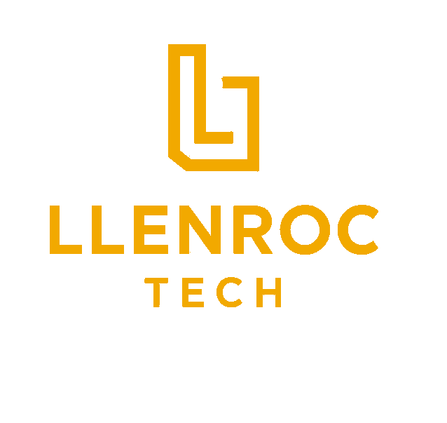

#  LlenrocTech.com

> **Enterprise Software Consulting • AI Solutions • Modern Web Platform**

The official source code for **LlenrocTech.com**, the public website and digital platform for **Llenroc Tech LLC**.

This repository powers the company website, AI assistant experience, customer engagement features, future client portal, and supporting cloud infrastructure.

---

## Overview

LlenrocTech.com is more than a marketing website.

It serves as the foundation for:

- Enterprise consulting services
- AI-powered customer assistant
- Client & Talent Portal
- Knowledge Center
- Future customer authentication
- Azure cloud services
- Payment integration
- Contact and service request workflows

The platform is designed using modern enterprise architecture with a clear separation between frontend, backend, infrastructure, and documentation.

---

# Technology Stack

## Frontend

- Angular 20+
- TypeScript
- SCSS
- RxJS
- Angular Router

## Backend (Current)

- Netlify Functions
- Azure OpenAI
- Azure Functions (infrastructure)

## Future Backend

- Java 21
- Spring Boot 4
- Spring Security
- Spring Data JPA
- MySQL
- REST APIs

## Cloud

- Microsoft Azure
- Azure OpenAI
- Azure Functions

## Hosting

- Netlify

## DevOps

- GitHub
- GitHub Actions
- Netlify Deploy Previews

---

# Repository Structure

```
frontend/
└── llenroctech-web/
    Angular website

backend/
└── llenroctech-api/
    Future Spring Boot backend

netlify/
└── functions/
    Temporary serverless backend

infrastructure/
├── azure/
├── docker/
└── netlify/

docs/
├── architecture/
├── api/
├── deployment/
└── screenshots/
```

---

# Current Features

- Responsive enterprise website
- Azure AI Assistant
- Contact forms
- Service request workflow
- Talent Network
- Client Portal foundation
- Knowledge Center
- AI Platform showcase
- Privacy Policy
- Terms & Conditions

---

# Planned Features

- Customer authentication
- Spring Boot backend
- Secure REST APIs
- Client Dashboard
- Talent Dashboard
- Stripe payment integration
- Customer messaging
- Project management portal
- Knowledge Center expansion
- AI-powered recommendations
- RAG document search
- MCP server integration

---

# Local Development

## Install

```bash
npm install
```

## Start Angular

```bash
npm run start --prefix frontend/llenroctech-web
```

## Start Netlify Dev

```bash
npm run start:netlify --prefix frontend/llenroctech-web
```

## Production Build

```bash
npm run build --prefix frontend/llenroctech-web
```

---

# Environment Variables

The AI assistant requires Azure OpenAI configuration.

Example:

```text
AZURE_OPENAI_ENDPOINT=
AZURE_OPENAI_KEY=
AZURE_OPENAI_DEPLOYMENT=
API_VERSION=

COMPANY_PHONE=
CONTACT_URL=
```

Environment variables should never be committed to source control.

---

# Documentation

Project documentation is maintained under the **docs/** directory.

Topics include:

- Architecture
- APIs
- Deployment
- Infrastructure
- Screenshots
- Future Roadmap

---

# Development Workflow

Feature development follows a pull-request workflow.

```
feature/*
        ↓
develop
        ↓
main
```

Every change should:

- Build successfully
- Pass validation
- Be reviewed through Pull Requests
- Keep `main` production-ready

---

# Roadmap

- Expand AI Platform
- Knowledge Center
- Spring Boot backend migration
- Azure cloud-native architecture
- Customer Portal
- Talent Portal
- Enterprise authentication
- GraphQL evaluation
- Mobile application support

---

# Company

**Llenroc Tech LLC**

Enterprise Software Consulting

Specializing in:

- Full-Stack Development
- Enterprise Architecture
- AI Solutions
- Cloud Engineering
- Application Modernization

---

# Credentials

- Veteran-Owned Business
- Fully Insured
- SAM.gov Registered
- C2C Consulting Available
- W-9 Available Upon Request

---

# License

Copyright © 2026 Llenroc Tech LLC.

All Rights Reserved.

# Portfolio and Innovation Gallery

The enterprise portfolio is available at `/portfolio`. Project content is centralized in `frontend/llenroctech-web/src/app/portfolio/portfolio.data.ts`; architecture, content, image, and Envato integration guidance is under `docs/architecture/`.

The optional Angular Template Inspiration section requires the server-side `ENVATO_PERSONAL_TOKEN` deployment variable. No token belongs in browser code or tracked files.

## Package manager

This repository uses npm. Keep the root and `frontend/llenroctech-web` `package-lock.json` files synchronized with their respective `package.json` files and use `npm ci` for reproducible local and Netlify builds. Yarn and Bun lockfiles are intentionally not maintained.
